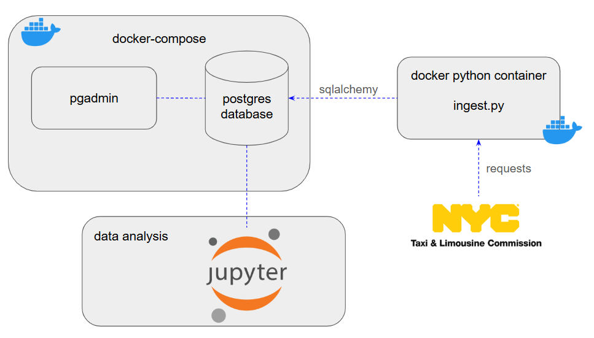

# NYC Taxi ETL Project

This project is an end-to-end ETL pipeline for processing and storing New York City taxi data. The pipeline fetches data from public APIs, processes it using Python (Pandas), and stores it in a PostgreSQL database. The entire setup is containerized using Docker, ensuring easy deployment and reproducibility.

## Overview
This project automates the process of fetching, transforming, and storing NYC taxi data. The key steps include:
1. **Data Extraction**: Fetch taxi trip data and zone information from public APIs.
2. **Data Transformation**: Process and clean the data using Python.
3. **Data Loading**: Save the processed data into a PostgreSQL database.

Below is a high-level architecture diagram summarizing the project:



The diagram illustrates the flow of data from extraction to storage, including Dockerized services for PostgreSQL and pgAdmin.

## Features
- **Data Extraction**: Fetches taxi trip data and zone lookup data from publicly available APIs.
- **Data Transformation**: Processes data using Pandas, converting formats (Parquet to CSV) and preparing it for database ingestion.
- **Data Loading**: Stores the processed data into a PostgreSQL database.
- **Containerized Environment**: Uses Docker and Docker Compose to set up PostgreSQL, pgAdmin, and the ETL script.

## Technologies Used
- **Python**: For data processing (Pandas, SQLAlchemy, Requests).
- **PostgreSQL**: As the database to store processed data.
- **Docker**: To containerize the application.
- **pgAdmin**: For database management.

## Prerequisites
Ensure you have the following installed:
- [Docker](https://www.docker.com/)
- [Docker Compose](https://docs.docker.com/compose/)

## Setup and Usage

### 1. Clone the Repository
```bash
git clone <repository-url>
cd <repository-folder>
```

### 2. Start the Services
Start PostgreSQL and pgAdmin services using Docker Compose:
```bash
docker-compose up
```
This will:
- Launch a PostgreSQL database on port `5432`.
- Launch pgAdmin on port `8080` (accessible via `http://localhost:8080`).

### 3. Build the ETL Docker Image
Build the Docker image for the Python ETL script:
```bash
docker build -t python-ingest .
```

### 4. Run the ETL Script
Run the ETL script inside a Docker container, passing the necessary parameters:
```bash
docker run -it --network=mynetwork python-ingest \
    --user=root \
    --password=root \
    --host=nyc-taxi-pgdatabase \
    --port=5432 \
    --db=ny_taxi \
    --table_name1=ny_taxi_trips \
    --url1=https://d37ci6vzurychx.cloudfront.net/trip-data/green_tripdata_2019-10.parquet \
    --table_name2=ny_taxi_zones \
    --url2=https://d37ci6vzurychx.cloudfront.net/misc/taxi_zone_lookup.csv
```

### 5. Access the Data
You can explore the data using:
- **pgAdmin**: Access it at `http://localhost:8080` using the credentials:
  - Email: `admin@admin.com`
  - Password: `root`
- **PostgreSQL CLI**: Connect to the database:
```bash
pgcli -h localhost -p 5432 -u root -d ny_taxi
```

### 6. Explore the Database
List all tables in the database:
```sql
\dt
```

## Project Structure
```
.
├── Dockerfile               # Dockerfile to build the ETL image
├── docker-compose.yaml      # Docker Compose configuration
├── scripts/
│   └── ingest.py            # Main ETL script
├── useful_commands.txt      # Helpful commands for setup and debugging
└── .gitignore               # Git ignore file
```

## Notes
- Ensure the API URLs provided in the commands are active and accessible.
- Modify the database connection parameters as needed.

## Author
Guilherme Semissatto
